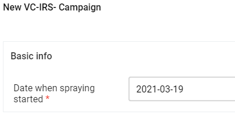

# IRS Campaign { #vc-irs-campaign }

IRS is a vector control intervention that consists in the application of a long-lasting, residual insecticide to potential vector resting surfaces (e.g. internal walls, eaves and ceilings of all houses, structures or domestic animal shelters). When vectors come to rest onto the sprayed surfaces, they absorb a lethal dose of insecticide and die.  Thus the mosquitoes are impeded from biting and transmitting the malaria parasite to people in the vicinity.
IRS can be implemented through campaigns where spray teams visit each household of the target area and spray all eligible structures in the household, provided they are granted permission by household owners.

## Event configuration

| Sections                            | Description     |
|-------------------------------------|-------|
| Basic info                          | Campaign’s start date             |
| Intervention timing                 | Campaign’s end date and info on the people in the sprayed area    |
| Insecticide and formulation sprayed | Type, concentration and formulation of the insecticide used during teh campaign         |
| IRS campaign results                | Final number of houses sprayed and info on the effective population inhabiting the area |
| Status            | Tick box to complete the event registration      |
| Comment       | Writing box to allow any kind of reporting of additional accompanying notes       |

### Data elements

The full list of data elements is available in the [Metadata Reference File](resources/VC-IRS-CAMPAIGN.xlsx).

## Event details

### New event registration

New campaign registration](resources/images/VC_IRS_CAM_001.png)

The event requires the reporting institution and the organization unit where the activity was carried out. Being a campaign taking place at the lowest level of reporting, the community itself and its households, the implementation needs to choose carefully the level of reporting in order to be able to analyze and identify correctly the campaign, while being able to integrate the results in the national routine HMIS.

### Basic Info

### Intervention Timing

The section provides info on the campaign’s start date as well as the number of men and women in the targeted area,

### Insecticide and formulation sprayed

The section reports the product, its active ingredient, its concentration, and the qiaontity of used formulation during the campaign.

### IRS Campaign Results

The campaign's final numbers are to be reported in the results section. 

### Status and Comments

## Analytics

### Program rules

The program rules of the program are available in the [Metadata Reference File](resources/VC-IRS-CAMPAIGN.xlsx).

### Program indicators

The list of PIs and indicators is available in the [Metadata Reference File](resources/VC-IRS-CAMPAIGN.xlsx).

It should be noted that some of the key PIs are available for consultation directly in the data entry page on the top right of the screen. 

## Visualizations

The package comes with a predefined VC-IRS-CR (Campaign Results) dashboard.
The table below provides the naming and info about the visualizations.

| Item name                   | Title                                         | Type        |
|-----------------------------|-----------------------------------------------|-------------|
| IRS-CR-001 People protected | Proportion of protected people (%)            | Map         |
| IRS-CR-002 Coverage         | IRS Campaign Coverage (structures and people) | Scatterplot |
| IRS-CR-003 Summary          | Summary of the campaigns                      | Pivot table |

Depending on the local availability of insecticides, it is suggested to have also a map to observe the geographical distribution of the sprayed products.

## Resources

WHO, (2014). [Indoor residual spraying: an operational manual for IRS for malaria transmission, control and elimination](https://www.who.int/publications/i/item/9789241508940).
